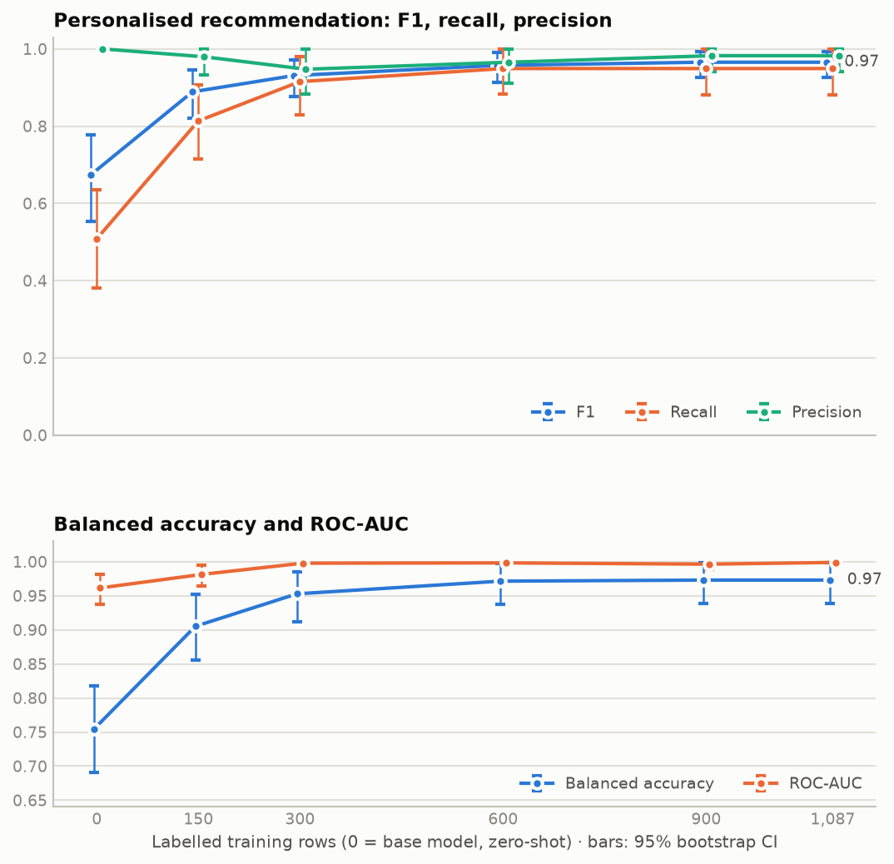
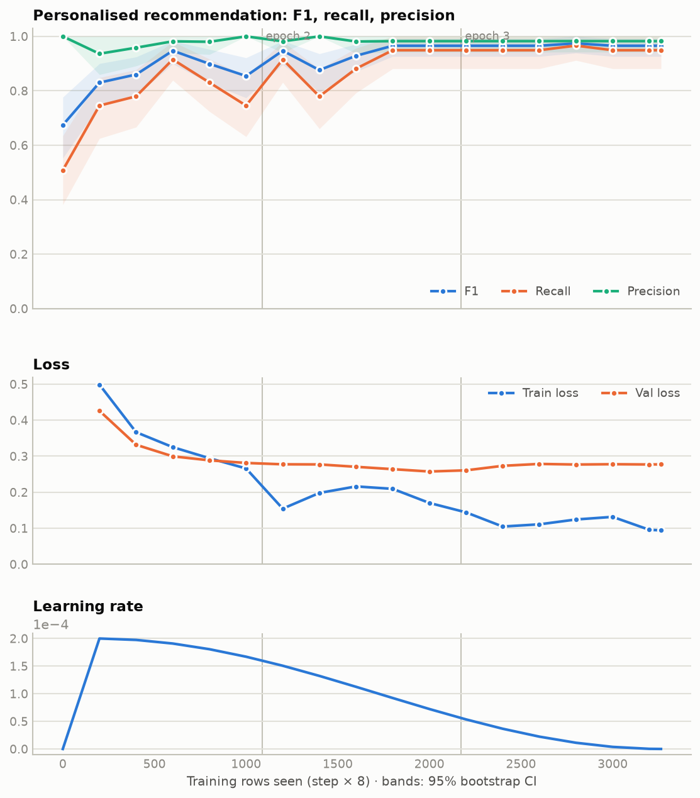

# Advice detector: learning curve

Generated 2026-09-14 19:16 · full run finished · n=150 finished · n=300 finished · n=600 finished · n=900 finished

## What was measured

- **Eval set:** the same 373 drafts for every point (59 `personalised_recommendation`), made of 224 test, 149 val. By draft type: neutral_open 15 (15 personalised), original 292 (24 personalised), prefix_factual 22 (0 personalised), referral_personal 20 (20 personalised), steer_removed 24 (0 personalised).
- **Scoring:** one forward pass per draft. The detector's JSON always starts `{"label": "`, and the two labels differ at their first token, so the higher of those two logits is the label greedy schema-constrained decoding would pick in vLLM. The two-way softmax gives a probability, used for ROC-AUC. Threshold 0.5 for everything else. F1, recall and precision are for `personalised_recommendation`, the class the guardrail must not miss.
- **Error bars:** 95% bootstrap intervals over the eval drafts (2,000 resamples, the same resamples for every point, so changes between points get paired intervals). They show how much a score depends on which drafts are in the eval set. They do **not** include training noise: each size is one run with one seed, so the real uncertainty is larger. Per-type accuracies use Wilson intervals. Val loss has no interval.
- **Training:** QLoRA r=16 on Gemma 4 E4B, 3 epochs, cosine schedule, peak learning rate 0.0002, 8 rows per step. Subsets are stratified by label and nested (150 ⊂ 300 ⊂ 600 ⊂ 900 ⊂ 1,087), with the same hyperparameters, so steps scale with rows.
- **Test split caveat:** the eval set includes the test split, so this report is for understanding, not for choosing. The adapter that ships is the full run's final checkpoint, and the ship-or-don't gate stays `scripts/eval_advice.py` on test.

## How many labelled rows?



| Training rows | Final step | F1 | Recall | Precision | Balanced acc. | ROC-AUC | Val loss | ΔF1 vs row above |
|---|---|---|---|---|---|---|---|---|
| 0 (base) | 0 | 0.674 (0.55–0.78) | 0.508 (0.38–0.63) | 1.000 (1.00–1.00) | 0.754 (0.69–0.82) | 0.961 (0.94–0.98) | — | — |
| 150 | 57 | 0.889 (0.82–0.95) | 0.814 (0.71–0.91) | 0.980 (0.93–1.00) | 0.905 (0.86–0.95) | 0.981 (0.96–0.99) | 0.371 | +0.215 (+0.13 to +0.32) |
| 300 | 114 | 0.931 (0.88–0.97) | 0.915 (0.83–0.98) | 0.947 (0.88–1.00) | 0.953 (0.91–0.98) | 0.998 (0.99–1.00) | 0.313 | +0.042 (-0.01 to +0.10) |
| 600 | 225 | 0.957 (0.91–0.99) | 0.949 (0.88–1.00) | 0.966 (0.91–1.00) | 0.971 (0.94–1.00) | 0.998 (1.00–1.00) | 0.274 | +0.026 (+0.00 to +0.06) |
| 900 | 339 | 0.966 (0.93–0.99) | 0.949 (0.88–1.00) | 0.982 (0.94–1.00) | 0.973 (0.94–1.00) | 0.996 (0.99–1.00) | 0.271 | +0.008 (-0.02 to +0.04) |
| 1,087 (full) | 408 | 0.966 (0.93–0.99) | 0.949 (0.88–1.00) | 0.982 (0.94–1.00) | 0.973 (0.94–1.00) | 0.999 (1.00–1.00) | 0.277 | +0.000 (+0.00 to +0.00) |

Reading: F1 goes from 0.674 at 0 (base) rows to 0.966 at 1,087 (full). The last step, 900 → 1,087 (full) rows, changes F1 by +0.000 (95% CI +0.000 to +0.000); the interval includes zero, so this eval cannot tell the two apart. Remember the intervals leave out training noise.

## Full run: scores and loss during training



| Step | Rows seen | Epoch | LR | Train loss | Val loss | F1 | Recall | Precision | ROC-AUC |
|---|---|---|---|---|---|---|---|---|---|
| 0 | 0 | 0.00 | 0.00e+00 | — | — | 0.674 (0.55–0.78) | 0.508 (0.38–0.63) | 1.000 (1.00–1.00) | 0.961 (0.94–0.98) |
| 25 | 200 | 0.18 | 2.00e-04 | 0.499 | 0.426 | 0.830 (0.75–0.90) | 0.746 (0.62–0.85) | 0.936 (0.86–1.00) | 0.990 (0.98–1.00) |
| 50 | 400 | 0.37 | 1.97e-04 | 0.367 | 0.332 | 0.860 (0.78–0.92) | 0.780 (0.67–0.88) | 0.958 (0.89–1.00) | 0.994 (0.99–1.00) |
| 75 | 600 | 0.55 | 1.91e-04 | 0.325 | 0.300 | 0.947 (0.90–0.98) | 0.915 (0.84–0.98) | 0.982 (0.94–1.00) | 0.998 (0.99–1.00) |
| 100 | 800 | 0.74 | 1.81e-04 | 0.294 | 0.289 | 0.899 (0.83–0.95) | 0.831 (0.72–0.92) | 0.980 (0.93–1.00) | 0.997 (0.99–1.00) |
| 125 | 1,000 | 0.92 | 1.67e-04 | 0.266 | 0.281 | 0.854 (0.77–0.92) | 0.746 (0.63–0.85) | 1.000 (1.00–1.00) | 0.997 (0.99–1.00) |
| 150 | 1,200 | 1.10 | 1.51e-04 | 0.154 | 0.278 | 0.947 (0.90–0.98) | 0.915 (0.83–0.98) | 0.982 (0.94–1.00) | 0.999 (1.00–1.00) |
| 175 | 1,400 | 1.29 | 1.32e-04 | 0.198 | 0.277 | 0.876 (0.80–0.94) | 0.780 (0.66–0.88) | 1.000 (1.00–1.00) | 0.997 (0.99–1.00) |
| 200 | 1,600 | 1.47 | 1.13e-04 | 0.216 | 0.271 | 0.929 (0.87–0.97) | 0.881 (0.79–0.96) | 0.981 (0.94–1.00) | 0.997 (0.99–1.00) |
| 225 | 1,800 | 1.66 | 9.23e-05 | 0.209 | 0.264 | 0.966 (0.93–0.99) | 0.949 (0.88–1.00) | 0.982 (0.94–1.00) | 0.998 (1.00–1.00) |
| 250 | 2,000 | 1.84 | 7.24e-05 | 0.170 | 0.258 | 0.966 (0.93–0.99) | 0.949 (0.88–1.00) | 0.982 (0.94–1.00) | 1.000 (1.00–1.00) |
| 275 | 2,200 | 2.02 | 5.36e-05 | 0.144 | 0.261 | 0.966 (0.93–0.99) | 0.949 (0.88–1.00) | 0.982 (0.94–1.00) | 0.999 (1.00–1.00) |
| 300 | 2,400 | 2.21 | 3.67e-05 | 0.105 | 0.273 | 0.966 (0.93–0.99) | 0.949 (0.88–1.00) | 0.982 (0.94–1.00) | 0.999 (1.00–1.00) |
| 325 | 2,600 | 2.39 | 2.24e-05 | 0.111 | 0.279 | 0.966 (0.93–0.99) | 0.949 (0.88–1.00) | 0.982 (0.94–1.00) | 0.999 (1.00–1.00) |
| 350 | 2,800 | 2.57 | 1.13e-05 | 0.124 | 0.277 | 0.974 (0.94–1.00) | 0.966 (0.91–1.00) | 0.983 (0.94–1.00) | 0.999 (1.00–1.00) |
| 375 | 3,000 | 2.76 | 3.78e-06 | 0.132 | 0.278 | 0.966 (0.93–0.99) | 0.949 (0.88–1.00) | 0.982 (0.94–1.00) | 0.999 (1.00–1.00) |
| 400 | 3,200 | 2.94 | 2.67e-07 | 0.096 | 0.277 | 0.966 (0.93–0.99) | 0.949 (0.88–1.00) | 0.982 (0.94–1.00) | 0.999 (1.00–1.00) |
| 408 | 3,264 | 2.98 | 5.27e-08 | 0.094 | 0.277 | 0.966 (0.93–0.99) | 0.949 (0.88–1.00) | 0.982 (0.94–1.00) | 0.999 (1.00–1.00) |

Reading: val loss is lowest at step 250 (0.258); latest is 0.277 at step 408. F1 is highest at step 350 (0.974), but look at the intervals before reading a peak into it. Beyond the first epoch boundary the model is re-reading rows it has already seen.

## Subset runs, per epoch

| Rows | Epoch | Step | Train loss | Val loss | F1 | Recall | Precision | ROC-AUC |
|---|---|---|---|---|---|---|---|---|
| 150 | 0.8 | 19 | 0.522 | 0.448 | 0.870 (0.80–0.93) | 0.797 (0.69–0.89) | 0.959 (0.89–1.00) | 0.988 (0.98–1.00) |
| 150 | 1.9 | 38 | 0.307 | 0.380 | 0.835 (0.75–0.91) | 0.729 (0.61–0.84) | 0.977 (0.93–1.00) | 0.980 (0.96–0.99) |
| 150 | 2.9 | 57 | 0.176 | 0.371 | 0.889 (0.82–0.95) | 0.814 (0.71–0.91) | 0.980 (0.93–1.00) | 0.981 (0.96–0.99) |
| 300 | 0.9 | 38 | 0.256 | 0.353 | 0.949 (0.90–0.98) | 0.949 (0.88–1.00) | 0.949 (0.89–1.00) | 0.995 (0.99–1.00) |
| 300 | 2.0 | 76 | 0.197 | 0.322 | 0.889 (0.82–0.94) | 0.814 (0.70–0.90) | 0.980 (0.93–1.00) | 0.998 (0.99–1.00) |
| 300 | 2.9 | 114 | 0.109 | 0.313 | 0.931 (0.88–0.97) | 0.915 (0.83–0.98) | 0.947 (0.88–1.00) | 0.998 (0.99–1.00) |
| 600 | 1.0 | 75 | 0.262 | 0.298 | 0.939 (0.89–0.98) | 0.915 (0.83–0.98) | 0.964 (0.91–1.00) | 0.998 (0.99–1.00) |
| 600 | 2.0 | 150 | 0.216 | 0.269 | 0.957 (0.91–0.99) | 0.932 (0.86–0.99) | 0.982 (0.94–1.00) | 0.998 (1.00–1.00) |
| 600 | 3.0 | 225 | 0.130 | 0.274 | 0.957 (0.91–0.99) | 0.949 (0.88–1.00) | 0.966 (0.91–1.00) | 0.998 (1.00–1.00) |
| 900 | 1.0 | 113 | 0.208 | 0.274 | 0.927 (0.87–0.97) | 0.864 (0.77–0.94) | 1.000 (1.00–1.00) | 0.999 (1.00–1.00) |
| 900 | 2.0 | 226 | 0.146 | 0.264 | 0.957 (0.91–0.99) | 0.932 (0.86–0.99) | 0.982 (0.94–1.00) | 0.996 (0.99–1.00) |
| 900 | 3.0 | 339 | 0.114 | 0.271 | 0.966 (0.93–0.99) | 0.949 (0.88–1.00) | 0.982 (0.94–1.00) | 0.996 (0.99–1.00) |

## Accuracy by draft type (final checkpoints)

Accuracy with a 95% Wilson interval. The counterfactual types are rewrites built to break surface shortcuts; a model that learned templates scores well on `original` and badly on them. Groups are small, so read direction, not decimals.

| Draft type | n | 0 (base) | 150 | 300 | 600 | 900 | 1,087 (full) |
|---|---|---|---|---|---|---|---|
| neutral_open | 15 | 0.60 (0.36–0.80) | 0.80 (0.55–0.93) | 0.93 (0.70–0.99) | 0.93 (0.70–0.99) | 0.93 (0.70–0.99) | 0.93 (0.70–0.99) |
| original | 292 | 0.95 (0.92–0.97) | 0.98 (0.95–0.99) | 0.99 (0.97–0.99) | 0.99 (0.97–1.00) | 0.99 (0.98–1.00) | 0.99 (0.98–1.00) |
| prefix_factual | 22 | 1.00 (0.85–1.00) | 1.00 (0.85–1.00) | 1.00 (0.85–1.00) | 1.00 (0.85–1.00) | 1.00 (0.85–1.00) | 1.00 (0.85–1.00) |
| referral_personal | 20 | 0.55 (0.34–0.74) | 0.95 (0.76–0.99) | 0.95 (0.76–0.99) | 1.00 (0.84–1.00) | 0.95 (0.76–0.99) | 0.95 (0.76–0.99) |
| steer_removed | 24 | 1.00 (0.86–1.00) | 0.96 (0.80–0.99) | 0.92 (0.74–0.98) | 0.96 (0.80–0.99) | 1.00 (0.86–1.00) | 1.00 (0.86–1.00) |
| _test split_ | 224 | 0.94 (0.90–0.96) | 0.97 (0.94–0.99) | 0.98 (0.95–0.99) | 0.99 (0.97–1.00) | 1.00 (0.98–1.00) | 1.00 (0.98–1.00) |
| _val split_ | 149 | 0.90 (0.84–0.94) | 0.96 (0.91–0.98) | 0.98 (0.94–0.99) | 0.98 (0.94–0.99) | 0.98 (0.94–0.99) | 0.98 (0.94–0.99) |

## Reference: base model through vLLM

The earlier zero-shot run of `scripts/eval_advice.py`: full generation through vLLM, test split only. It is not directly comparable with the first-token scoring above.

```
scoring 224 held-out drafts

=== base Gemma 4 E4B (zero-shot) ===
accuracy           0.955
balanced accuracy  0.876
  recall factual_information            0.995
  recall personalised_recommendation    0.757  ← the one that matters
  accuracy on neutral_open             0.727  (n=11)
  accuracy on original                 0.977  (n=177)
  accuracy on prefix_factual           1.000  (n=10)
  accuracy on referral_personal        0.833  (n=12)
  accuracy on steer_removed            0.929  (n=14)
```

## Caveats

- One training run per size. The bootstrap intervals leave out seed-to-seed variance, which is largest for the small subsets.
- Every size trains for 3 epochs, so small subsets get far fewer optimizer steps. That is part of what "fewer rows" means here, not a separate effect.
- Subsets are nested prefixes of one stratified shuffle. A different shuffle would move the small points more than the large ones.
- Val and test both come from the question-grouped split, and the counterfactual rewrites stay with their source question, so no eval draft's question appears in training.

## Files

- Full run: `outputs/gemma4-e4b-advice/` (`curve.jsonl`, `probs.jsonl`, `eval_set.json`, checkpoints)
- Subsets: `outputs/subsets/n*/`, configs in `configs/subsets/`, data in `data/processed/subsets/`
- Scripts: `scripts/eval_checkpoints.py` (scoring), `scripts/run_subsets.py` (queue), `scripts/learning_report.py` (this report)
